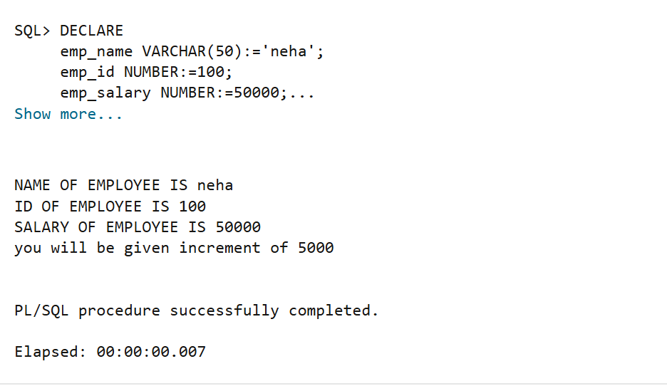

Aim
To understand the basic structure of a PL/SQL program by creating and executing a simple PL/SQL block that includes declaration and execution sections, and to display output using built-in procedures.
Software Requirements
o	PostgreSQL
o	pgAdmin

Objectives
•  To understand the use of the DECLARE section in PL/SQL.
•  To learn how to declare and initialize variables in PL/SQL.
•  To use DBMS_OUTPUT.PUT_LINE for displaying output.
•  To implement conditional logic using the IF–ELSE statement.
•  To determine salary increment based on a given condition.

Problem Statement
Design and implement a simple PL/SQL program that demonstrates the basic structure of a PL/SQL block. The program should include a declaration section to define variables and an execution section to perform operations using those variables and display the results using appropriate output statements.
Declaration Section (DECLARE)
Variables are declared and initialized:
•	emp_id → Employee ID
•	emp_name → Employee Name
•	emp_salary → Employee Salary
Execution Section (BEGIN ... END)
DBMS_OUTPUT.PUT_LINE is used to display output.

Practical/Experiment Steps
•	Start the PL/SQL environment.
•	Enable server output to view the program output.
•	Declare variables for employee name, ID, and salary.
•	Assign initial values to the declared variables.
•	Display the employee details using DBMS_OUTPUT.PUT_LINE.
•	Use an IF–ELSE statement to check the salary condition.
•	Display the increment message based on the condition.
•	Execute the program and observe the output.
Procedure
•	Open SQL Plus or any PL/SQL-supported interface.
•	In the DECLARE section, define variables for employee name, employee ID, and salary with appropriate data types.
•	Initialize the variables with sample values.
•	In the BEGIN block, display the employee details using DBMS_OUTPUT.PUT_LINE.
•	Apply an IF–ELSE condition to compare the employee salary.
•	Display the increment message based on whether the salary is greater than 70,000.
•	End the program using END;.
•	Execute the program and verify the output.

Input/Output Analysis
DECLARE
emp_name VARCHAR(50):='neha';
emp_id NUMBER:=100;
emp_salary NUMBER:=50000;
BEGIN
DBMS_OUTPUT.PUT_LINE('NAME OF EMPLOYEE IS '||emp_name);
DBMS_OUTPUT.PUT_LINE('ID OF EMPLOYEE IS '||emp_id);
DBMS_OUTPUT.PUT_LINE('SALARY OF EMPLOYEE IS '||emp_salary);
IF emp_salary>70000 THEN
DBMS_OUTPUT.PUT_LINE('you will be given increment of 10000');
    ELSE
    DBMS_OUTPUT.PUT_LINE('you will be given increment of 5000');
    END IF;
END;

Output

Learning Outcomes
•	Understand the structure of a PL/SQL block.
•	Declare and initialize variables in PL/SQL.
•	Use output statements to display data.
•	Apply conditional logic using IF–ELSE.
•	Develop simple decision-making programs in PL/SQL.
