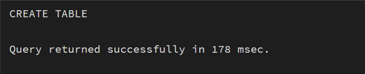
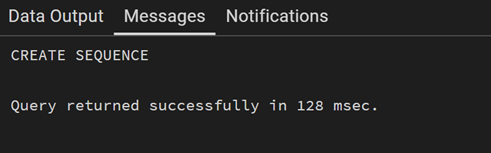
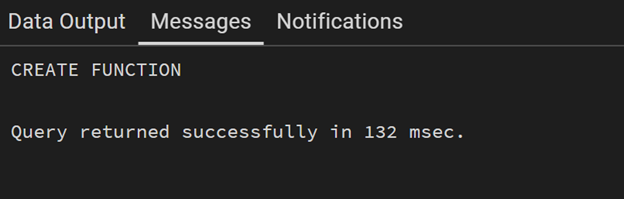
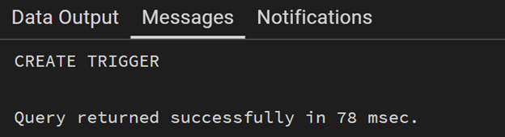
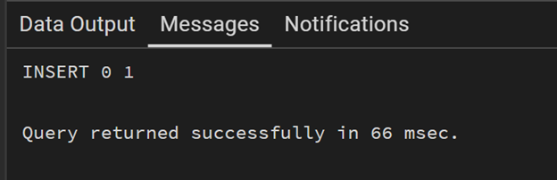
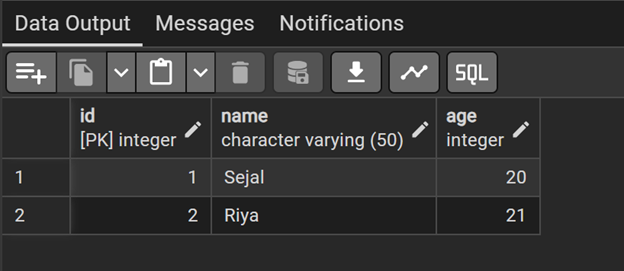

# Experiment: Trigger for Automatic Primary Key Generation

## AIM
To design and implement a database trigger that automatically generates or enforces a primary key, ensuring unique identification of records without manual intervention.

---

## SOFTWARE REQUIREMENTS

### Database Management System:
- Oracle Database Express Edition  
- PostgreSQL  

### Database Administration Tool / Client Tool:
- Oracle SQL Developer  
- pgAdmin  

---

## OBJECTIVE

- To create a trigger that automatically generates unique primary key values during record insertion.  
- To replicate stored procedure-like logic using triggers.  
- To ensure data integrity and eliminate manual errors in primary key assignment.  

---

## PROBLEM STATEMENT

In enterprise-level databases, each record must have a unique primary key. Manual entry of primary keys may lead to duplication or inconsistencies.

Design a trigger that:
- Automatically assigns a unique primary key value before inserting a record.  
- Ensures no duplicate or null primary key values exist.  
- Implements logic similar to a stored procedure for automation.  

This concept is widely used in real-world applications such as e-commerce platforms (Amazon, Flipkart) and enterprise database systems.

---

## PROCEDURE

1. Create a table where the primary key will be automatically generated.  
2. Create a sequence (in Oracle/PostgreSQL) to generate unique numbers.  
3. Write a trigger that executes BEFORE INSERT on the table.  
4. Inside the trigger, assign the next value of the sequence to the primary key field.  
5. Insert multiple records without specifying the primary key.  
6. Verify that each record gets a unique primary key automatically.  

---

## INPUT/OUTPUT ANALYSIS

### SQL Input Queries

**1. Input:**
```sql
CREATE TABLE students (
    id INT PRIMARY KEY,
    name VARCHAR(50),
    age INT
);


```




**2. Input:**
```sql
CREATE SEQUENCE student_seq START 1;

```

**Output:**





**3. Input:**
```sql

CREATE OR REPLACE FUNCTION student_trigger_function()
RETURNS TRIGGER AS $$
BEGIN
IF NEW.id IS NULL THEN
NEW.id := nextval('student_seq');
END IF;
RETURN NEW;
END;
$$ LANGUAGE plpgsql;

```

**Output:**





**4. Input:**
```sql
CREATE TRIGGER student_trigger
BEFORE INSERT ON students
FOR EACH ROW
EXECUTE FUNCTION student_trigger_function();


```

**Output:**





**5. Input:**
```sql
INSERT INTO students (name, age) VALUES ('Sejal', 20);
INSERT INTO students (name, age) VALUES ('Riya', 21);


```

**Output:**





**6.. Input:**
```sql

SELECT * FROM students;

```
**Output:**




---

## Learning Outcomes
*	Understand the concept and working of database triggers. 
*	Implement automatic primary key generation using triggers. 
*	Ensure data integrity and avoid duplication errors. 
*	Apply trigger-based automation in real-world enterprise systems.
