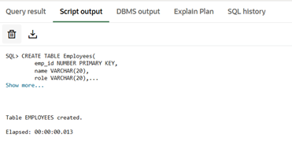
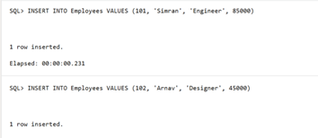
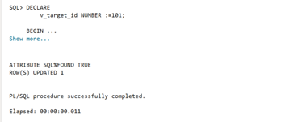
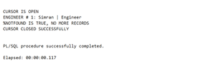

# Experiment 6

## Aim
To understand the concept and working of cursors in PL/SQL for row-by-row data processing, and to analyse how implicit cursors, explicit cursors, and cursor attributes are used to implement business logic on multiple rows in a database table.

---

## Objectives
* To implement and analyse the use of implicit cursors, explicit cursors, and cursor attributes for processing multiple rows from a database table and applying business logic effectively.

---

## Practical/Experiment Steps
* Schema Provisioning: Created the Employees table with specific data types for IDs, names, roles, and salaries to simulate a corporate database environment.
* Implicit Cursor Analysis: Implemented an anonymous PL/SQL block to perform a single-row UPDATE operation, utilizing the internal SQL cursor to monitor DML success.
* Explicit Cursor Design: Defined a named cursor (c_engg) to fetch specific records based on the 'Engineer' role, enabling structured row-by-row processing.
* Attribute Integration: Incorporated cursor attributes such as %FOUND, %NOTFOUND, %ROWCOUNT, and %ISOPEN to programmatically control the execution flow.
* Business Logic Application: Developed logic to apply salary increments and format record-specific output, demonstrating how enterprise rules are applied to individual data rows

---

## Procedure
1. Logged into the database environment and ensured SERVEROUTPUT was enabled to capture procedural messages.
2. Executed the CREATE TABLE and INSERT scripts to establish the foundational employee dataset.
3. Initiated a PL/SQL block using an implicit cursor to update a specific employee’s salary and verified the change using SQL%ROWCOUNT.
4. Declared an explicit cursor in a separate block, specifically targeting employees with the ‘Engineer’ role.
5. Opened the explicit cursor and used the %ISOPEN attribute to confirm the cursor was successfully initialized in memory.
6. Implemented a LOOP structure to sequentially FETCH data from the active set into local variables (v_name, v_role).
7. Used the %NOTFOUND attribute as an exit condition to terminate the loop once all relevant records were processed.
8. Monitored the %ROWCOUNT attribute to display a dynamic count for each record retrieved during the iteration.
9. Closed the cursor explicitly to release system resources and verified the closure using the NOT c_engg%ISOPEN condition.


---

## I/O Analysis

**1. Input:**
```sql
CREATE TABLE Employees(
    emp_id NUMBER PRIMARY KEY,
    name VARCHAR(20),
    role VARCHAR(20),
    salary NUMBER
);
```

**Output:**





**2. Input:**
```sql
INSERT INTO Employees VALUES (101, 'Mary', 'Engineer', 85000);
INSERT INTO Employees VALUES (102, 'Amit', 'Analyst', 45000);
INSERT INTO Employees VALUES (103, 'Sara', 'Engineer', 90000);
INSERT INTO Employees VALUES (104, 'Sam', 'Analyst', 80000);
COMMIT;
```

**Output:**





**3. Input:**
```sql
SET SERVEROUTPUT ON;

DECLARE
    v_target_id NUMBER :=101;

BEGIN 
    UPDATE Employees 
    SET salary = salary*1.10
    WHERE emp_id = v_target_id;

    IF SQL%FOUND THEN
        DBMS_OUTPUT.PUT_LINE('ATTRIBUTE SQL%FOUND TRUE');
        DBMS_OUTPUT.PUT_LINE('ROW(S) UPDATED '||SQL%ROWCOUNT);
    ELSE
        DBMS_OUTPUT.PUT_LINE('NO ROW UPDATED');
    END IF;

END;
```

**Output:**





**4. Input:**
```sql
DECLARE
    CURSOR c_engg IS SELECT name, role FROM Employees WHERE role = 'Engineer';
    v_name Employees.name%TYPE;
    v_role Employees.role%TYPE;

BEGIN

    OPEN c_engg;

    IF c_engg%ISOPEN THEN
    DBMS_OUTPUT.PUT_LINE('CURSOR IS OPEN');
    END IF;

    LOOP
        FETCH c_engg INTO v_name, v_role;

        IF c_engg%NOTFOUND THEN
            DBMS_OUTPUT.PUT_LINE('%NOTFOUND IS TRUE, NO MORE RECORDS');
            EXIT;
        END IF;

        DBMS_OUTPUT.PUT_LINE('ENGINEER # '||c_engg%ROWCOUNT|| ': ' 
        || v_name || ' | ' || v_role);
    
    END LOOP;

    CLOSE c_engg;

    IF NOT c_engg%ISOPEN THEN
        DBMS_OUTPUT.PUT_LINE('CURSOR CLOSED SUCCESSFULLY');
    END IF;
END;
```

**Output:**





---

## Learning Outcomes
* Gained proficiency in differentiating between implicit cursors for DML and explicit cursors for multi-row queries.
* Learnt using %FOUND, %NOTFOUND, and %ROWCOUNT to manage loop iterations and verify operation success.
* Understanding the importance of the OPEN, FETCH, and CLOSE lifecycle to ensure efficient memory management.
* Ability to develop PL/SQL programs that apply complex business logic to individual records within a larger dataset.