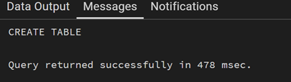
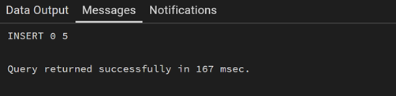
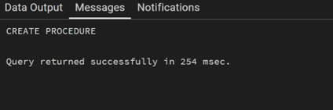
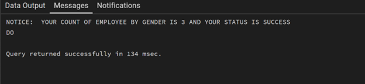

# Experiment 8

## 🔹 AIM
To create and execute a PL/pgSQL stored procedure that counts the number of employees based on gender using input, output, and inout parameters.

---

## 🔹 SOFTWARE REQUIREMENTS
- PostgreSQL (version 10 or above)
- pgAdmin / SQL Shell (psql)
- Operating System: Windows/Linux/Mac

---

## 🔹 OBJECTIVES
- To understand the concept of stored procedures in PL/pgSQL
- To learn the use of IN, OUT, and INOUT parameters
- To perform data retrieval using SELECT INTO
- To execute procedures using the CALL statement
- To display output using RAISE NOTICE

---

## 🔹 EXPERIMENT STEPS
1. Create a table `employees` with required fields.
2. Insert sample data into the table.
3. Create a stored procedure using PL/pgSQL.
4. Use input parameter to pass gender.
5. Use output parameter to store count.
6. Use INOUT parameter to track status.
7. Call the procedure inside a DO block.
8. Display results using `RAISE NOTICE`.

---

## 🔹 PROCEDURE (CODE)

1. Table Creation
•	A table employees is created with: 
o	emp_id → Primary key 
o	emp_name → Employee name 
o	gender → Gender of employee 
o	salary → Salary 
2. Data Insertion
•	Sample employee records are inserted into the table. 
3. Stored Procedure Creation
•	Procedure name: get_Employee_Count_BY_Gender 
•	Parameters: 
o	IN_GENDER → Input gender 
o	OUT_COUNT → Stores employee count 
o	STATUS → Stores execution status
4. Logic Used
•	SELECT COUNT(*) INTO OUT_COUNT counts employees. 
•	STATUS := 'SUCCESS' updates execution status. 
5. Execution Block
•	A DO block is used to: 
o	Declare variables 
o	Call the procedure 
o	Print output using RAISE NOTICE

---

## INPUT/OUTPUT ANALYSIS
**1. Input:**
```sql
CREATE TABLE employees (
    emp_id SERIAL PRIMARY KEY,
    emp_name VARCHAR(50),
    gender VARCHAR(10),
    salary NUMERIC(10,2)
);
```

**Output:**





**2. Input:**
```sql
INSERT INTO employees (emp_name, gender, salary) VALUES
('Amit', 'Male', 30000),
('Riya', 'Female', 35000),
('John', 'Male', 28000),
('Sneha', 'Female', 40000),
('Rahul', 'Male', 32000);

```

**Output:**





**3. Input:**
```sql
CREATE OR REPLACE PROCEDURE  get_Employee_Count_BY_Gender (IN IN_GENDER VARCHAR(20), OUT OUT_COUNT INT, INOUT STATUS VARCHAR(20))
AS
$$
	BEGIN

		SELECT COUNT(*) INTO OUT_COUNT  FROM employees  WHERE GENDER='Male';
		STATUS:='SUCCESS';
	
	END;

$$ LANGUAGE PLPGSQL;

```

**Output:**





**4. Input:**
```sql
DO
$$
DECLARE
GEN VARCHAR(20):='Male';
Count_of_Employee int;
STATUS VARCHAR:='Pending';
BEGIN
	CALL  get_Employee_Count_BY_Gender(GEN,Count_of_Employee,STATUS);
	RAISE NOTICE 'YOUR COUNT OF EMPLOYEE BY GENDER IS % AND YOUR STATUS IS %',Count_of_Employee,STATUS;
END;

$$

```

**Output:**




## Learning Outcomes
*	Understand how to create stored procedures in PostgreSQL 
*	Use IN, OUT, INOUT parameters effectively 
*	Perform data retrieval using SELECT INTO 
*	Execute procedures using CALL 
*	Handle procedural logic in PL/pgSQL
