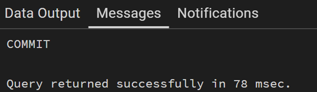

# Experiment 9

## Aim
To create and implement PL/SQL packages by developing a package specification and package body containing procedures and shared cursors, in order to achieve modular, reusable, and efficient database programming.
---

## Objectives
To design and implement a PL/SQL package that includes procedures and shared cursors for structured and modular program development.

---

## Procedure
1.	Initialization of Environment
The Oracle database environment was started using SQL Developer. A connection was established with the required database to perform the experiment. 
2.	Creation of Employee Table
A table named employee was created with appropriate attributes such as employee ID, name, salary, and department. The employee ID was defined as the primary key to uniquely identify each record. 
3.	Insertion of Sample Data
Sample records were inserted into the employee table to facilitate testing of the package procedures and cursor operations. 
4.	Creation of Package Specification
A package specification was designed to declare the procedures that can be accessed externally. This included procedures for fetching all employee details and retrieving a specific employee based on ID. 
5.	Creation of Package Body
The package body was implemented to define the actual logic of the procedures declared in the specification. This included the implementation of procedures and database operations. 
6.	Implementation of Shared Cursor
A shared cursor was created within the package body to retrieve employee records. This cursor was reused by different procedures, ensuring modularity and reducing redundancy. 
7.	Implementation of Procedures
Procedures were developed inside the package to display all employee records and to fetch details of a specific employee. These procedures utilized the shared cursor and SQL queries. 
8.	Execution of Package Procedures
The procedures defined in the package were executed using PL/SQL blocks. The output was displayed using standard output mechanisms. 
9.	Verification of Results
The results obtained from executing the procedures were verified to ensure that the correct employee data was retrieved and displayed. 
10.	Testing and Validation
Multiple test cases were performed by retrieving different employee records to validate the correctness, efficiency, and reusability of the package. 


---

## I/O Analysis

**1. Input:**
```sql
CREATE SCHEMA emp_package;

```


**2. Input:**
```sql
CREATE TABLE employee (
    emp_id NUMBER PRIMARY KEY,
    emp_name VARCHAR2(50),
    salary NUMBER,
    department VARCHAR2(50)
);

```

**Output:**


**3. Input:**
```sql
INSERT INTO employee VALUES (1, 'Sejal', 50000, 'AI');
INSERT INTO employee VALUES (2, 'Rahul', 45000, 'IT');
INSERT INTO employee VALUES (3, 'Priya', 60000, 'HR');

COMMIT;

$$;
```

**Output:**


**4. Input:**
```sql
CREATE OR REPLACE PACKAGE emp_package AS

    -- Procedure to display all employees
    PROCEDURE get_all_employees;

    -- Procedure to display employee by ID
    PROCEDURE get_employee_by_id(p_id NUMBER);

END emp_package;

```

**Output:**


**5. Input:**
```sql
CREATE OR REPLACE PACKAGE BODY emp_package AS

    -- Shared Cursor
    CURSOR emp_cursor IS
        SELECT emp_id, emp_name, salary, department FROM employee;

    -- Procedure to display all employees
    PROCEDURE get_all_employees IS
    BEGIN
        FOR rec IN emp_cursor LOOP
            DBMS_OUTPUT.PUT_LINE(
                'ID: ' || rec.emp_id ||
                ', Name: ' || rec.emp_name ||
                ', Salary: ' || rec.salary ||
                ', Dept: ' || rec.department
            );
        END LOOP;
    END;

    -- Procedure to display employee by ID
    PROCEDURE get_employee_by_id(p_id NUMBER) IS
    BEGIN
        FOR rec IN (SELECT * FROM employee WHERE emp_id = p_id) LOOP
            DBMS_OUTPUT.PUT_LINE(
                'ID: ' || rec.emp_id ||
                ', Name: ' || rec.emp_name ||
                ', Salary: ' || rec.salary ||
                ', Dept: ' || rec.department
            );
        END LOOP;
    END;

END emp_package;
/

```

**Output:**


**6.. Input:**
```sql

SET SERVEROUTPUT ON;

```
**Output:**


---

**7.. Input:**
```sql

-- DISPLAY ALL EMPLOYEES
BEGIN
    EMP_PACKAGE.GET_ALL_EMPLOYEES;
END;
/

-- DISPLAY SPECIFIC EMPLOYEE
BEGIN
    EMP_PACKAGE.GET_EMPLOYEE_BY_ID(1);
END;
/


```
**Output:**




---

## Learning Outcomes
*	Learned difference between specification and body 
*	Implemented shared cursor 
*	Developed modular and reusable code 
*	Gained industry-relevant skills
