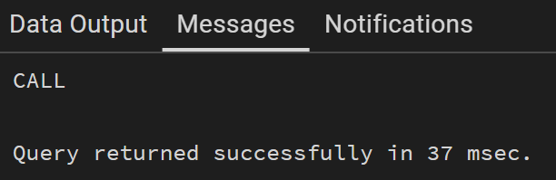

# Experiment 9

## Aim
To design and implement stored procedures in PostgreSQL for performing CRUD (Create, Read, Update, Delete) operations in an efficient, secure, and reusable manner.
---

## Objectives
* Understand stored procedures
* Implement parameterized procedures
* Perform CRUD operations
* Improve performance and security
* Gain industry-relevant SQL experienc

---

## Theory

Stored procedures are precompiled SQL statements stored in the database and executed when required. They help in improving performance, reducing redundancy, and enhancing security by limiting direct table access.


---

## Procedure
1. Start PostgreSQL environment
2. Create a table
3. Implement INSERT procedure
4. Execute INSERT procedure
5. Implement READ operation
6. Execute READ operation
7. Implement UPDATE procedure
8. Execute UPDATE procedure
9. Implement DELETE procedure
10. Execute DELETE procedure
11. Verify all operations
12. Perform testing and validation


---

## I/O Analysis

**1. Input:**
```sql
CREATE TABLE student (
    id SERIAL PRIMARY KEY,
    name VARCHAR(50),
    age INT,
    course VARCHAR(50)
);
```


**2. Input:**
```sql
CREATE OR REPLACE PROCEDURE insert_student(
    s_name VARCHAR,
    s_age INT,
    s_course VARCHAR
)
LANGUAGE plpgsql
AS $$
BEGIN
    INSERT INTO student(name, age, course)
    VALUES (s_name, s_age, s_course);
END;
$$;
```

**Output:**


**3. Input:**
```sql
CREATE OR REPLACE PROCEDURE get_students()
LANGUAGE plpgsql
AS $$
BEGIN
    PERFORM * FROM student;
END;
$$;
```

**Output:**


**4. Input:**
```sql
CREATE OR REPLACE PROCEDURE update_student(
    s_id INT,
    s_name VARCHAR,
    s_age INT,
    s_course VARCHAR
)
LANGUAGE plpgsql
AS $$
BEGIN
    UPDATE student
    SET name = s_name,
        age = s_age,
        course = s_course
    WHERE id = s_id;
END;
$$;
```

**Output:**


**5. Input:**
```sql
CREATE OR REPLACE PROCEDURE delete_student(s_id INT)
LANGUAGE plpgsql
AS $$
BEGIN
    DELETE FROM student WHERE id = s_id;
END;
$$;
```

**Output:**


**6.. Input:**
```sql
CALL insert_student('Sejal', 20, 'CSE');
CALL update_student(1, 'Sejal Patial', 21, 'AI-ML');
CALL delete_student(1);
```
**Output:**




---

## Learning Outcomes
* Trigger Lifecycle Mastery: Understanding the difference between statement-level and row-level triggers and when to use BEFORE vs AFTER events.
* Automated Data Calculation: Proficiency in using triggers to derive and populate column values, reducing the logic burden on the application layer.
* Custom Constraint Enforcement: Ability to implement complex business rules and validations that go beyond standard CHECK constraints.
* Error Handling and Signaling: Mastery of the RAISE EXCEPTION mechanism to communicate specific business logic failures to the user or application.