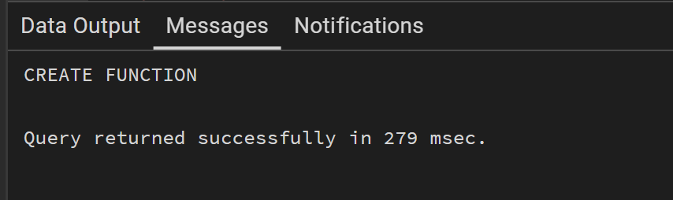
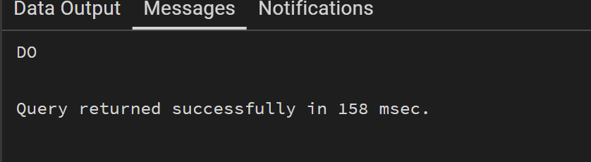
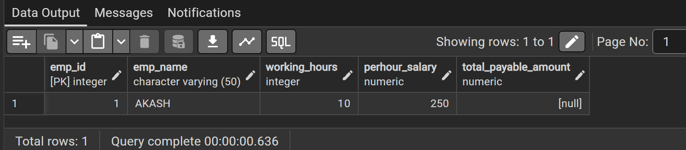
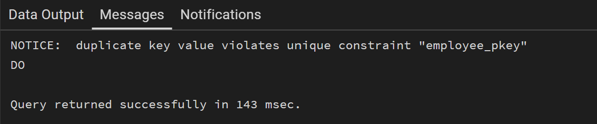

# Experiment 9

## Aim
To understand and implement database triggers in PostgreSQL to automate data validation and computational logic, ensuring data integrity by enforcing business rules during DML operations.

---

## Objectives
* To create a trigger function that performs automatic calculations on row-level data.
* To define a BEFORE INSERT trigger that intercepts data entry for validation.
* To implement custom exception handling using the RAISE EXCEPTION command.
* To verify trigger behaviour by testing both valid and invalid data scenarios within a transaction.

---

## Practical/Experiment Steps
* Schema Provisioning: Established the employee table with dedicated columns for base data (hours and rate) and a calculated column for the final payable amount.
* Trigger Function Development: Authored a PL/pgSQL function designed to calculate the product of working hours and hourly rates dynamically.
* Automated Validation Logic: Embedded a conditional check within the function to prevent the insertion of records where the calculated amount exceeds a predefined limit.
* Trigger Binding: Configured a row-level trigger to execute the function specifically BEFORE any INSERT operation occurs on the table.
* Operational Stress Testing: Utilized anonymous DO blocks to simulate data entry and verify that the system correctly identifies and blocks prohibited transactions.


---

## Procedure
1. Accessed the PostgreSQL console and created the employee table structure.
2. Defined the CALCULATE_AMOUNT() function using the NEW keyword to access and modify incoming row data before it is written to the disk.
3. Integrated a mathematical formula to populate the total_payable_amount field automatically.
4. Created the CAL_PAYABLE_AMOUNT trigger, ensuring it was set to FOR EACH ROW to evaluate every individual record.
5. Executed a successful INSERT test case where the calculated result was below 25,000 to confirm normal operations.
6. Ran a SELECT query to verify that the trigger correctly computed and stored the total amount despite it not being provided in the INSERT statement.
7. Attempted an invalid INSERT with values resulting in an amount over 25,000 to trigger the custom exception.
8. Implemented exception handling in the test blocks to capture and display the SQLERRM (error message) generated by the trigger.
9. Analysed the final table state to confirm that the invalid record was successfully blocked by the trigger logic.


---

## I/O Analysis

**1. Input:**
```sql
CREATE TABLE employee (
    emp_id INT PRIMARY KEY,
    emp_name VARCHAR(50),
    working_hours INT,
    perhour_salary NUMERIC,
    total_payable_amount NUMERIC
);
```


**2. Input:**
```sql
CREATE OR REPLACE FUNCTION CALCULATE_AMOUNT()
RETURNS TRIGGER
AS
$$
BEGIN
	NEW.total_payable_amount=NEW.perhour_salary*NEW.working_hours;
	IF NEW.total_payable_amount>25000 THEN
		RAISE EXCEPTION 'AMOUNT IS GREATER THAN 25000';
	END IF;
	RETURN NEW;
END;
$$
LANGUAGE PLPGSQL;
```

**Output:**





**3. Input:**
```sql
CREATE OR REPLACE TRIGGER CAL_PAYABLE_AMOUNT
BEFORE INSERT
ON EMPLOYEE
FOR EACH ROW
EXECUTE FUNCTION CALCULATE_AMOUNT();
```

**Output:**





**4. Input:**
```sql
DO
$$
BEGIN
	INSERT INTO EMPLOYEE(EMP_ID, EMP_NAME, WORKING_HOURS, PERHOUR_SALARY) VALUES
	(1, 'AKASH', 10, 250);

	EXCEPTION
	WHEN OTHERS THEN
	RAISE NOTICE '%', SQLERRM;
END;
$$;

SELECT * FROM EMPLOYEE;
```

**Output:**




 


**5. Input:**
```sql
DO
$$
BEGIN
	INSERT INTO EMPLOYEE(EMP_ID, EMP_NAME, WORKING_HOURS, PERHOUR_SALARY) VALUES
	(1, 'AKASH', 10, 250000);

	EXCEPTION
	WHEN OTHERS THEN
	RAISE NOTICE '%', SQLERRM;
END;
$$;

SELECT * FROM EMPLOYEE;
```

**Output:**


 


---

## Learning Outcomes
* Trigger Lifecycle Mastery: Understanding the difference between statement-level and row-level triggers and when to use BEFORE vs AFTER events.
* Automated Data Calculation: Proficiency in using triggers to derive and populate column values, reducing the logic burden on the application layer.
* Custom Constraint Enforcement: Ability to implement complex business rules and validations that go beyond standard CHECK constraints.
* Error Handling and Signaling: Mastery of the RAISE EXCEPTION mechanism to communicate specific business logic failures to the user or application.